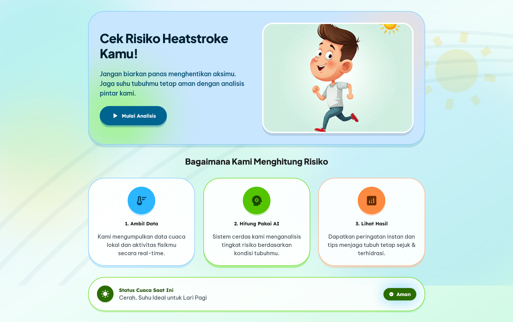
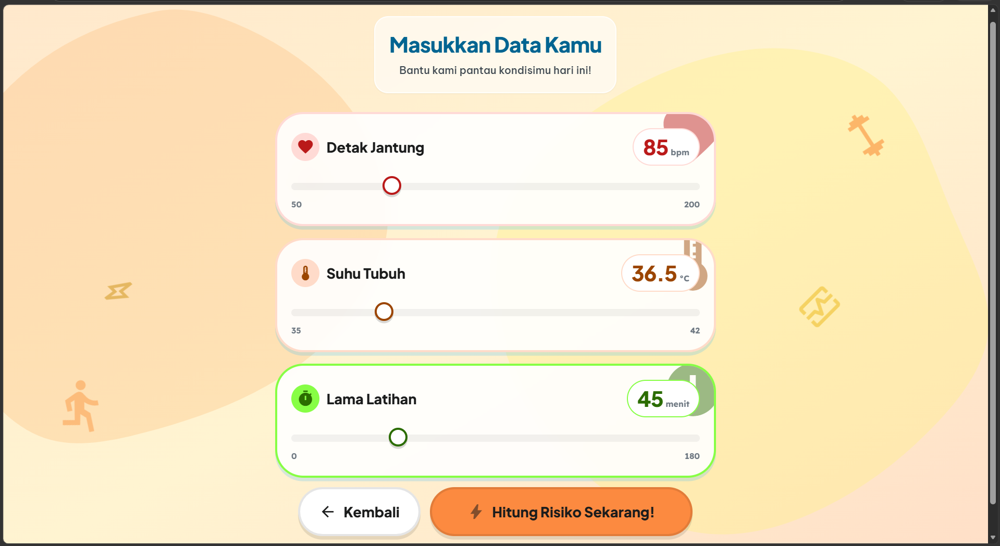
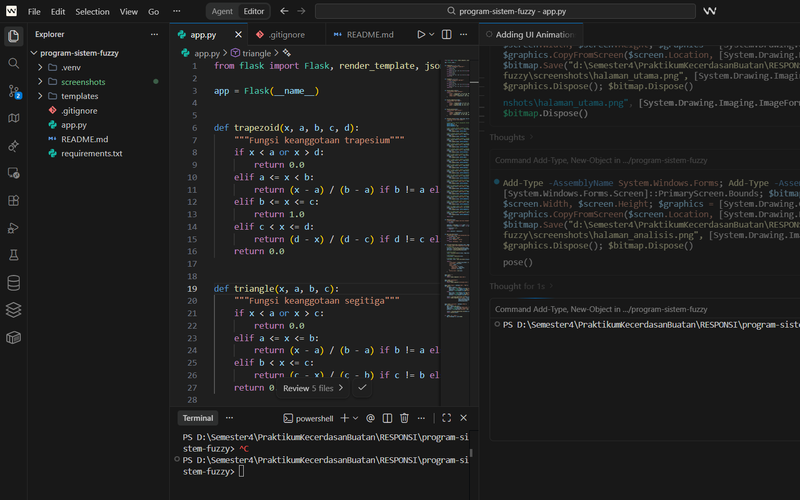

# Sistem Deteksi Risiko Heatstroke dengan Fuzzy Logic Sugeno

# Identitas Mahasiswa

- **Nama:** Zahwa Nafiza Azzahra
- **NIM:** H1D024015
- **Shift KRS:** H
- **Shift Sekarang:** F

# Link Deployment
**https://heatsense-fuzzy.vercel.app/**

## Deskripsi

Sistem ini adalah aplikasi web berbasis Flask yang menggunakan metode **Fuzzy Logic Sugeno** untuk menghitung risiko heatstroke berdasarkan tiga parameter input:
- Detak jantung (bpm)
- Suhu tubuh (°C)
- Lama latihan (menit)

## Fitur Utama

- **Halaman Utama**: Landing page yang menampilkan informasi tentang sistem dan cara kerjanya
- **Halaman Analisis**: Form input interaktif dengan slider untuk memasukkan data
- **Halaman Hasil**: Menampilkan tingkat risiko heatstroke (Aman, Waspada, Berbahaya) dengan detail perhitungan fuzzy

## Metodologi Fuzzy Logic Sugeno

### Parameter Input & Himpunan Fuzzy

#### 1. Detak Jantung (50-200 bpm)
- **Normal**: Trapezoidal (50, 60, 90, 100)
- **Cepat**: Triangular (90, 115, 140)
- **Sangat Cepat**: Trapezoidal (130, 140, 190, 200)

#### 2. Suhu Tubuh (35-42 °C)
- **Normal**: Trapezoidal (35, 35.5, 37, 37.5)
- **Hangat**: Triangular (37, 37.8, 38.5)
- **Panas**: Trapezoidal (38, 38.5, 41, 42)

#### 3. Lama Latihan (0-180 menit)
- **Singkat**: Trapezoidal (0, 5, 35, 45)
- **Sedang**: Triangular (30, 60, 90)
- **Lama**: Trapezoidal (75, 90, 160, 180)

### Output Fuzzy
- **Aman** = 0
- **Waspada** = 50
- **Berbahaya** = 100

### Defuzzifikasi
Metode rata-rata terbobot (weighted average) untuk mendapatkan output crisp (0-100)

### Aturan Fuzzy
Sistem menggunakan 17 aturan fuzzy untuk menentukan tingkat risiko berdasarkan kombinasi dari tiga input.

### Kategori Risiko
- **0-40**: Aman
- **41-70**: Waspada
- **71-100**: Berbahaya

## Teknologi yang Digunakan

- **Backend**: Python dengan Flask
- **Frontend**: HTML5, Tailwind CSS (via CDN)
- **Icons**: Google Material Symbols
- **Fonts**: Be Vietnam Pro, Plus Jakarta Sans, Lexend

## Struktur Project

```
program-sistem-fuzzy/
├── app.py                 # Flask application dengan logika fuzzy
├── requirements.txt       # Dependensi Python
├── templates/            # HTML templates
│   ├── index.html        # Halaman utama
│   ├── pertanyaan.html   # Halaman input data
│   └── hasil.html        # Halaman hasil analisis
└── README.md            # Dokumentasi project
```

## Cara Menjalankan

1. Install dependensi:
```bash
pip install flask
```

2. Jalankan aplikasi:
```bash
python app.py
```

## Screenshots

### Halaman Utama


Halaman utama menampilkan informasi tentang sistem deteksi risiko heatstroke dengan desain yang menarik dan animasi yang interaktif.

### Halaman Analisis


Halaman analisis menyediakan form input dengan slider interaktif untuk memasukkan detak jantung, suhu tubuh, dan lama latihan.

### Halaman Hasil


Halaman hasil menampilkan tingkat risiko heatstroke dengan gauge visual, langkah-langkah yang disarankan, dan detail perhitungan fuzzy.

## Lisensi

Project ini dibuat untuk keperluan responsi mata kuliah Kecerdasan Buatan.
